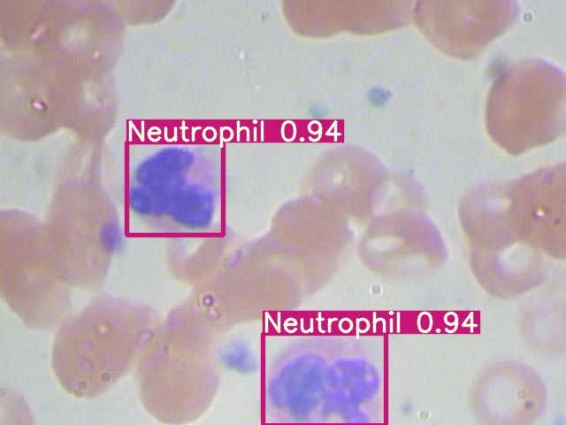
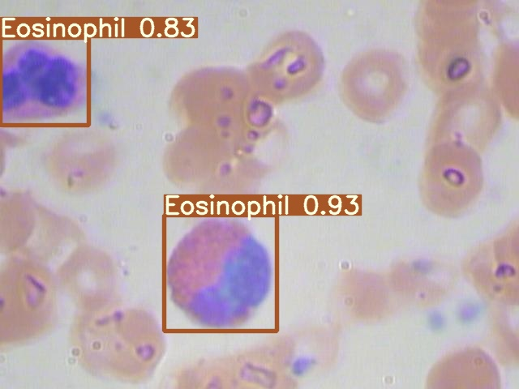

# Training a TensorFlow Yolov5 Object Detection Model on enhanced BCCD

## Introduciton
 One-stage object detection model Faster-rcnn were applied to classify 
 
 **neutrophils, eosinophils, monocytes, and lymphocytes** on an enhanced BCCD dataset.

## Preparing  Images and Annotations

 BCCD image is avaliable on https://www.kaggle.com/paultimothymooney/blood-cells

 Image annotation can accomplish by **labelImg**  <https://github.com-/tzutalin/labelImg>

## Creating Yolo.format annotation files
 Transform your annotation file to ```.txt``` file. 

  The whole Yolov5 Dataset Structure is as follows:

  ```
  - bcc
    - Images
        - Train (.jpg files)
        - Valid (.jpg files)
    - labels
        - Train (.txt files)
        - Valid (.txt files)
  ```

## Training the model on GoogleColab 
 [](https://colab.research.google.com/drive/1ykDblSdT_NzMha0Mh5N7cskfuiYfc67y?usp=sharing)

## Inference on unseen images
  [](https://colab.research.google.com/drive/1ykDblSdT_NzMha0Mh5N7cskfuiYfc67y?usp=sharing)


 

 

 
